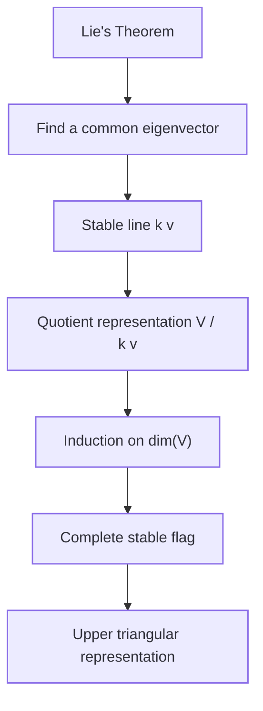
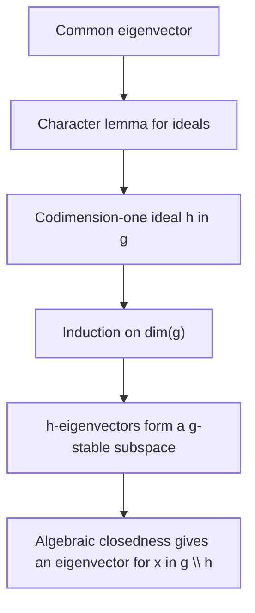
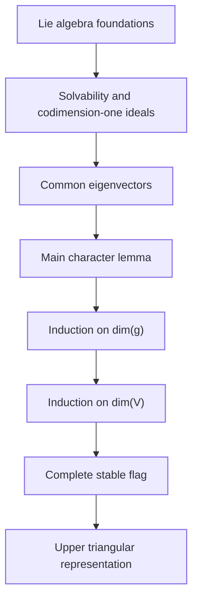

# Lie's Theorem: A Structural Approach to Solvable Lie Algebras

This repository contains an expository reconstruction of Lie's Theorem for finite-dimensional representations of solvable Lie algebras. Rather than presenting a new proof, the manuscript expands the classical argument of Serre into a step-by-step structural exposition that makes every major reduction and induction step explicit.

The manuscript develops the structural ingredients behind the theorem - derived series, ideals, quotient representations, invariant subspaces, and complete flags - before assembling them into the final triangularization argument.

- **Title:** *Lie's Theorem: A Structural Approach to Solvable Lie Algebras*
- **Author:** Xi Chen
- **Date:** 11 November 2025
- **File:** [`documents/math3349_project.pdf`](documents/math3349_project.pdf)

## Highlights

- Complete proof of Lie's Theorem from first principles
- Step-by-step reconstruction of Serre's classical proof
- Expanded proofs of intermediate lemmas often compressed in standard texts
- Structural development from solvability to simultaneous triangularization
- Examples illustrating why algebraic closedness and characteristic zero are essential
- Corollaries connecting stable flags, ideals, and nilpotence of the derived algebra

## Intended Audience

This manuscript is intended for:

- undergraduate students learning Lie algebras;
- beginning graduate students studying representation theory;
- readers working through Serre's *Lie Algebras and Lie Groups*;
- anyone who wants a fully expanded proof of Lie's Theorem.

## Main Theorem

Let `k` be an algebraically closed field of characteristic zero, let `g` be a solvable Lie algebra over `k`, and let

```text
rho: g -> gl(V)
```

be a finite-dimensional representation. Then `V` admits a complete `g`-stable flag

```text
0 = V_0 subset V_1 subset ... subset V_n = V,
dim(V_i / V_{i-1}) = 1.
```

Equivalently, there is a basis of `V` in which every operator `rho(x)`, for `x in g`, is upper triangular.

## Proof Architecture

The proof is organized around one central goal: find a common eigenvector. Once such a vector exists, it spans a stable line; the representation descends to the quotient by that line; induction on `dim(V)` then builds a complete stable flag.



The common eigenvector step has its own internal structure:



## Key Mathematical Ideas

The exposition develops Lie's Theorem through the following structural ideas:

- solvability via the derived series;
- codimension-one ideals containing the derived algebra;
- common eigenvectors and stable lines;
- quotient representations;
- complete invariant flags;
- simultaneous triangularization;
- the character lemma and its trace argument.

## Expository Contribution

The proof is based principally on Jean-Pierre Serre's presentation in:

> Jean-Pierre Serre, *Lie Algebras and Lie Groups: 1964 Harvard Lectures*, Benjamin, 1965.

The purpose of this manuscript is not to claim a new theorem. Its contribution is pedagogical: it reorganizes Serre's argument into a self-contained exposition for readers who want to see exactly how the reductions, lemmas, and inductions fit together.

In particular, the manuscript:

- isolates the reduction to a common eigenvector;
- expands the codimension-one ideal construction;
- gives a complete proof of the character lemma;
- explains the induction through quotient representations;
- highlights precisely where algebraic closedness and characteristic zero enter;
- includes illustrative examples and counterexamples.

## Logical Flow

The manuscript follows the same order as the mathematics:



## Field Hypotheses

The assumptions on the base field are essential.

- Algebraic closedness is used to guarantee eigenvectors for linear operators on nonzero finite-dimensional invariant subspaces.
- Characteristic zero is used in the trace argument in the main character lemma, where the proof concludes from `n chi([x,h]) = 0` that `chi([x,h]) = 0`.

The manuscript includes counterexamples showing that Lie's Theorem can fail over `R` and in positive characteristic.

## Repository

| File | Description |
| --- | --- |
| `README.md` | Repository overview |
| `documents/math3349_project.pdf` | Full expository manuscript on Lie's Theorem |
| `CITATION.cff` | Citation metadata |

## Suggested Citation

If citing this exposition, please cite both the manuscript and Serre's original source.

```bibtex
@misc{chen_lies_theorem_structural_2025,
  author = {Chen, Xi},
  title = {Lie's Theorem: A Structural Approach to Solvable Lie Algebras},
  year = {2025},
  note = {Expository manuscript based on Serre's 1964 Harvard Lectures, with expanded intermediate steps and a beginner-oriented reconstruction of the proof.}
}

@book{serre_lie_algebras_1965,
  author = {Serre, Jean-Pierre},
  title = {Lie Algebras and Lie Groups: 1964 Harvard Lectures},
  publisher = {Benjamin},
  year = {1965}
}
```

## License

No open-source license is currently specified. Unless a license is added, all rights are reserved by the author.
